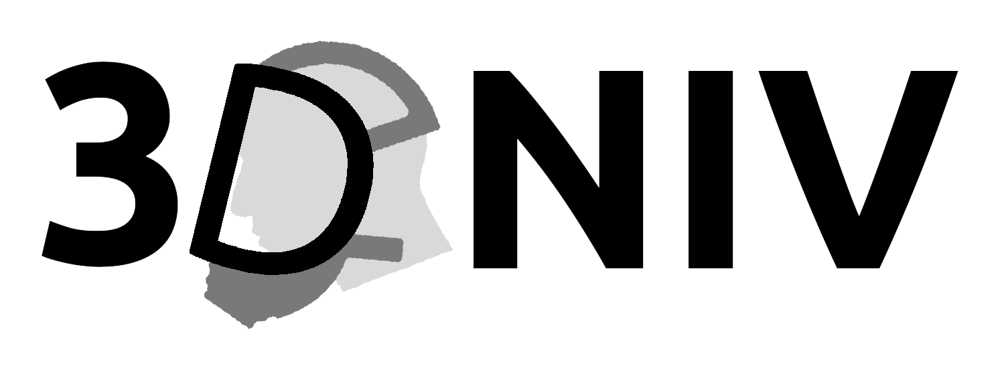

## 3DNIV

This is the project repository for the:    
**A Novel Dual Non-Invasive Ventilator Continuous Positive Airway Pressure Non-Aerosolization Circuit for Emergency Use in the COVID-19 Pandemic**

**Cite this work as:**   
_Vaughan, T.J., Kirrane, F., Moerman, K.M., Cahill, T., O’Regan, A. and O’Keeffe, D.T., 2020. A Novel Dual Non-Invasive Ventilator Continuous Positive Airway Pressure Non-Aerosolization Circuit for Emergency Use in the COVID-19 Pandemic. Journal of Open Hardware, 4(1), p.3. DOI: [http://doi.org/10.5334/joh.23](http://doi.org/10.5334/joh.23)_

**Long term archived version:** 

## Licenses
Hardware:     
Documentation and other content: 

## Table of contents
- [Project Summary](#Summary)  
- [Documentation](#Application)  
- [Contributing](#Contributing)  
- [Code of conduct](#CodeOfConduct)  
- [License](#License)  

## Project summary 
The COVID-19 pandemic is a public health emergency of unprecedented scale. The surge in clinical cases of patients with severe respiratory illness has overwhelmed the traditional capacity of healthcare systems worldwide. Continuous Positive Airway Pressure (CPAP) delivered through Non-Invasive Ventilation (NIV) has been shown to be useful in caring for patients with COVID-19. In particular patients with early stage milder acute hypoxemic respiratory failure can benefit from NIV CPAP therapy, though there is an acknowledged risk of COVID-19 aerosolization with traditional circuit use. Furthermore, given the surge in clinical care demand, there is an acute global shortage of ventilators, including NIV devices and therefore innovative methods are needed to increase NIV capacity and ameliorate infectious aerosolization. This project presents an emergency use modified dual NIV CPAP Circuit that uses a 3D printed splitter designed to work with traditional international NIV CPAP tubing standards and a 3D printed respiratory face mask knuckle to allow for distal expiratory breath exhalation through a viral filter rather than through an open to air proximal valve, which is the traditional NIV CPAP configuration. We expect that this work will increase global NIV CPAP capacity and ameliorate aerosolization of COVID-19 in patients undergoing therapy in an emergency scenario. 

### The standard NIC CPAP configuration

(a) Standard NIV CPAP Configuration b) Standard NIV Machine (c) Standard NIV 22mm Tubing Circuit and (d) Standard (22mm) NIV Facemask with expiratory knuckle valve.   

### The modified Dual NIV CPAP.

System-level schematic of the modified Dual NIV CPAP.

### 3D printed components

T-Piece component; (a) mechanical drawing with characteristic dimensions; (b) 3D Printed PLA T-Piece and (c) T-Piece connected to NIV machine/tubing.    

3D Printed Knuckle (a) mechanical drawing with characteristic dimensions; (b) 3D Printed PLA component and (c) T-Piece connected to facemask.  

## Documentation  
The documentation is in the /docs folder and takes the form of a MarkDown file, see: [documentation.md](https://github.com/3DNIV/3DNIV/blob/master/docs/documentation.md).

## Contributing  
We'd love for you to contribute to this project! We welcome all sorts of contributions including design, testing, documentation, and documentation translations. To help simple fork or clone this repository to start working and [post a new issue](https://github.com/Kevin-Mattheus-Moerman/3DNIV/issues/new/choose) if you have any questions. You may propose changes by creating a [pull-request](https://github.com/Kevin-Mattheus-Moerman/3DNIV/pulls).

## Code of conduct  
See: [COC.md](https://github.com/Kevin-Mattheus-Moerman/3DNIV/blob/master/COC.md)

## LICENSE 
The hardware contained and described in this repository is licensed under the [CERN Open Hardware Licence Version 2 - Strongly Reciprocal](https://github.com/Kevin-Mattheus-Moerman/3DNIV/blob/master/LICENSE) (see also: [https://cern-ohl.web.cern.ch/](https://cern-ohl.web.cern.ch/)). All other content (e.g. documentation) is released under the [CC-BY-4.0 license](https://creativecommons.org/licenses/by/4.0/legalcode). 
