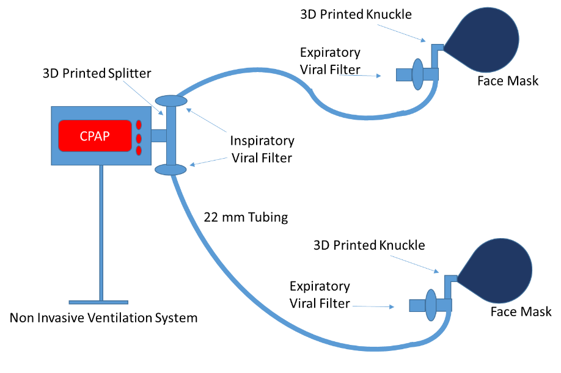

# 3DNIV
This is the repository for a low cost and open source:    
**Non-invasive ventilator circuit design for emergency use featuring 3D printed components to increase Continuous Positive Airway Pressure (CPAP) capacity and prevent infectious viral aerosolization in the COVID19 Pandemic**

Harware:     
Documentation and other content: 

## Table of contents
- [Project Summary](#Summary)  
- [Documentation](#Application)  
- [Contributing](#Contributing)  
- [Code of conduct](#CodeOfConduct)  
- [License](#License)  

## Project summary 
An Innovative Non Invasive Ventilator Circuit Design for Emergency Use using 3D printing Technology to increase Continuous Positive Airway Pressure (CPAP) capacity and Prevent Infectious Viral Aerosolization in the COVID19 Pandemic

### The standard NIC CPAP configuration

(a) Standard NIV CPAP Configuration b) Standard NIV Machine (c) Standard NIV 22mm Tubing Circuit and (d) Standard (22mm) NIV Facemask with expiratory knuckle valve.   

### The modified Dual NIV CPAP.

System-level schematic of the modified Dual NIV CPAP.

### 3D printed components

T-Piece component; (a) mechanical drawing with characteristic dimensions; (b) 3D Printed PLA T-Piece and (c) T-Piece connected to NIV machine/tubing.    

3D Printed Knuckle (a) mechanical drawing with characteristic dimensions; (b) 3D Printed PLA component and (c) T-Piece connected to facemask.  

## Documentation  
Coming soon

## Contributing  
We'd love for you to contribute to this project! We welcome all sorts of contributions including design, testing, documentation, and documentation translations. To help simple fork or clone this repository to start working and [post a new issue](https://github.com/Kevin-Mattheus-Moerman/3DNIV/issues/new/choose) if you have any questions. You may propose changes by creating a [pull-request](https://github.com/Kevin-Mattheus-Moerman/3DNIV/pulls).

## Code of conduct  
See: [COC.md](https://github.com/Kevin-Mattheus-Moerman/3DNIV/blob/master/COC.md)

## LICENSE 
The hardware contained and described in this repository is licensed under the [CERN Open Hardware Licence Version 2 - Strongly Reciprocal](https://github.com/Kevin-Mattheus-Moerman/3DNIV/blob/master/LICENSE) (see also: [https://cern-ohl.web.cern.ch/](https://cern-ohl.web.cern.ch/)).
